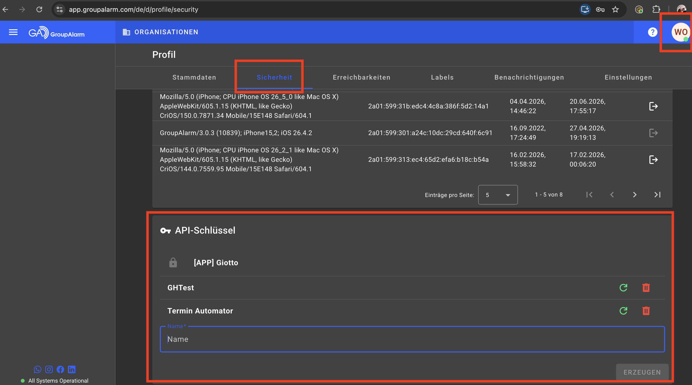
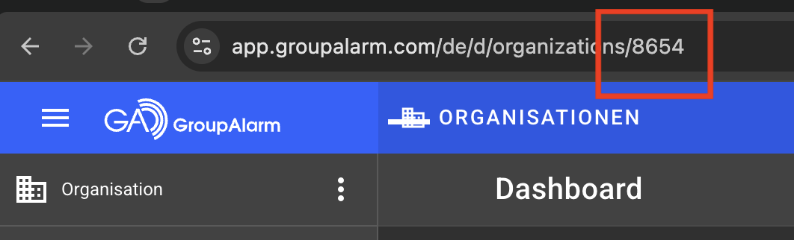
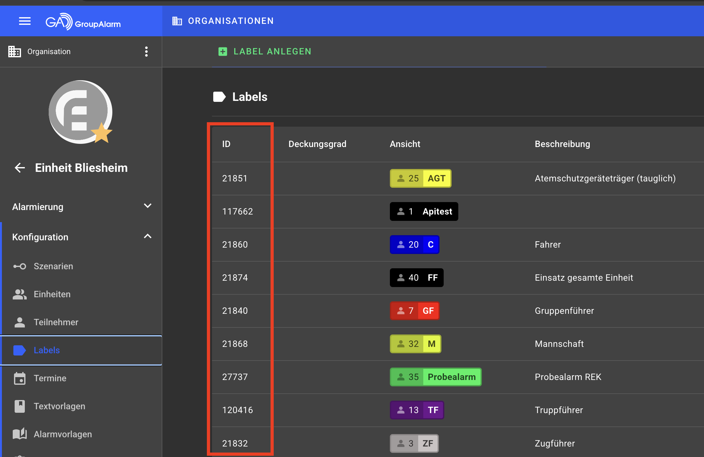

# Anleitung: Groupalarm-Terminverwaltung

Diese Anleitung ist für alle gedacht, die Termine (Übungsdienste etc.) über die
Web-Oberfläche bei Groupalarm anlegen dürfen. Sie bekommen diese Anleitung zusammen mit
einer Einladungs-Mail vom Admin.

---

## 1. Zugang erhalten

1. Der Admin legt für dich einen Account an. Du bekommst eine E-Mail mit einem Link.
2. **Der Link ist nur 48 Stunden gültig** - falls er abgelaufen ist, meld dich beim Admin.
3. Klick auf den Link, vergib dort dein Passwort (mindestens 10 Zeichen).
4. Du bist danach direkt eingeloggt.

Die Adresse der Anwendung lautet: `<ADRESSE VOM ADMIN EINTRAGEN>`

---

## 2. Einmalige Einrichtung (bevor du den ersten Termin anlegst)

Bevor du Termine anlegen kannst, musst du einmalig unter **Einstellungen** drei Dinge
hinterlegen: deine Groupalarm-**Organisation-ID**, die passenden **Label-IDs** und
deinen persönlichen **API-Token**. Alle drei findest du in deinem Groupalarm-Account,
nicht in dieser Anwendung.

### 2.1 API-Token generieren

In Groupalarm unter deinem Profil/den Account-Einstellungen kannst du einen
"Personal Access Token" erzeugen. Diesen Token brauchst du, damit die Anwendung in
deinem Namen Termine anlegen darf.



**Wichtig:** Der Token wird nur einmal angezeigt - kopiere ihn sofort und füge ihn
direkt unter **Einstellungen → Groupalarm API-Token** in der Anwendung ein. Die
Anwendung zeigt ihn danach nie wieder im Klartext an (nur "konfiguriert" bzw.
"nicht konfiguriert").

### 2.2 Organisation-ID finden



Die Organisation-ID trägst du unter **Einstellungen → Organisation-ID** ein.

### 2.3 Label-IDs finden

Labels bestimmen, wer in Groupalarm zu einem Termin eingeladen wird (z.B. "Aktive
Wehr", "Jugendfeuerwehr"). Du kannst mehrere Label-IDs angeben.



Trage die Label-IDs unter **Einstellungen → Label-IDs** ein, durch Komma getrennt,
z.B. `21868, 21840, 21832`.

---

## 3. Termine anlegen

Es gibt zwei Wege, die sich auch kombinieren lassen - beide landen zunächst in
derselben **Entwurfsliste**, wo du alles vor dem tatsächlichen Versand nochmal prüfen
und korrigieren kannst. Nichts wird sofort an Groupalarm gesendet.

### 3.1 Über das Formular ("Neuer Termin")

Trage Datum, Start-/Endzeit (Standard 19:00-21:00 Uhr, änderbar), Betreff (Standard
"Übungsdienst", änderbar) und Beschreibung ein und klicke auf "Zur Entwurfsliste
hinzufügen".

### 3.2 Über Datei-Upload ("Datei hochladen")

Für viele Termine auf einmal: eine Textdatei mit einer Zeile pro Termin hochladen.

**Format:**
```
YYYY-MM-DD Beschreibung
```
oder mit eigener Uhrzeit:
```
YYYY-MM-DD HH:MM-HH:MM Beschreibung
```

**Beispiel:**
```
2026-08-11 Übungsdienst FwDV 3
2026-08-18 17:00-19:00 Einsatzübung
# Diese Zeile wird ignoriert (Kommentar)
2026-08-25 Fahrzeug- und Gerätepflege
```

Ohne Uhrzeit gelten automatisch **19:00-21:00 Uhr**. Der Betreff steht nicht in der
Datei - jede hochgeladene Zeile bekommt automatisch den Betreff "Übungsdienst", den du
danach in der Entwurfsliste bei Bedarf pro Termin ändern kannst.

### 3.3 Entwurfsliste prüfen und senden

Nach dem Hinzufügen (egal ob per Formular oder Upload) siehst du alle Termine in einer
Liste. Zeilen mit Fehlern (z.B. ungültiges Datum) sind rot markiert und mit einer
Fehlermeldung versehen - klicke auf "Bearbeiten", um sie zu korrigieren, oder auf
"Löschen", um sie zu entfernen.

Erst wenn du auf **"Alle fehlerfreien Termine senden"** klickst, werden die Termine
tatsächlich an Groupalarm übermittelt. Fehlerhafte Zeilen werden dabei übersprungen
und bleiben zur Korrektur stehen.

---

## 4. Passwort vergessen

Auf der Login-Seite auf "Passwort vergessen?" klicken, E-Mail-Adresse eingeben. Du
bekommst einen Link, der **10 Minuten gültig** ist, und über den du ein neues Passwort
setzen kannst.

---

## 5. Häufige Fragen

**Ich sehe eine Fehlermeldung "Keine Organisation-ID hinterlegt" o.ä. beim Senden.**
→ Siehe Abschnitt 2 - Organisation-ID, Label-IDs und API-Token müssen einmalig unter
"Einstellungen" hinterlegt sein, bevor du Termine senden kannst.

**Ich möchte meinen API-Token ändern.**
→ Unter "Einstellungen" einfach einen neuen Token eingeben und speichern - der alte
wird dabei überschrieben.

**Kann ich einen bereits gesendeten Termin über die Anwendung wieder ändern?**
→ Nein, nur vor dem Senden (in der Entwurfsliste). Nach dem Senden bitte direkt in
Groupalarm bearbeiten.
